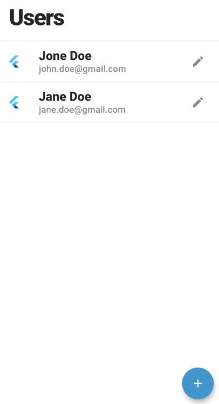

## About

This is a simple CRUD application built with Flutter for maintaining users. This project uses a [Hasura](https://www.hasura.io/) GraphQL API to interact with a PostgreSQL database that's hosted on [Heroku](https://www.heroku.com/).



---

## Setup

In order to run this application you need to install [Flutter](https://www.flutter.dev/).

## Run

```bash
flutter run
```

## Environment Configuration

You will need to create `lib/env_config.dart` with the following:

```dart
class EnvConfig {
  static const String GRAPHQL_URL = '<your_hasura_graphql_url>';
}
```

## PostgreSQL (Database)

The PostgreSQL database contains only a single schema with one table - `users`.

`users`

| Field      | Type | Optional | PK  |
| -----------|------|----------|-----|
| id         | int  | NO       | YES |
| first_name | text | NO       | YES |
| last_name  | text | NO       | YES |
| email      | text | NO       | YES |

## Credits
Created by [@scarnett](https://github.com/scarnett/)

## License
[](https://opensource.org/licenses/MIT)  
Copyright &copy; 2021 Scott Carnett. Licensed under the MIT License (MIT)
